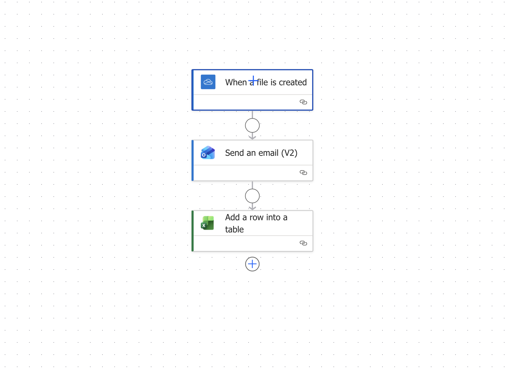

# ML-Powered Warehouse Operations Decision System

An end-to-end warehouse analytics and decision-support system built using real supply chain data to improve staffing, disruption response, throughput planning, and operational monitoring.

[](https://warehouse-garvit.streamlit.app)

---

## 🚀 Live Project Summary

- Built an end-to-end ML-powered warehouse decision system
- Achieved **R² = 0.874** for throughput prediction
- Identified an **89% performance gap between shifts**
- Quantified disruption cost impact at **$2,286/hour**
- Combined forecasting, classification, prediction, and decision logic into one system
- Extended the project with a **real-time Power Automate alerting layer**

**[→ Open the live Streamlit app](https://warehouse-garvit.streamlit.app)**

---

## Overview

Most warehouse operations still rely heavily on intuition for critical decisions such as staffing, disruption handling, and shift planning. This project was built to test what happens when those decisions are supported by a full analytics and machine learning pipeline instead.

The result is a warehouse decision system that combines:

- relational database design
- analytical SQL querying
- demand forecasting
- risk classification
- throughput prediction
- statistical validation
- explainability
- dashboarding
- interactive decision support
- real-time operational alerting

Rather than stopping at model building, this project focuses on translating model outputs into actions that managers can actually use.

---

## Business Problem

Warehouses often face three recurring challenges:

- staffing decisions made without forward-looking demand signals
- disruptions handled reactively after costs have already escalated
- throughput variation across shifts without clear data-driven intervention

This project addresses those problems by helping answer:

- How much demand should we expect over the next 30 days?
- Which operational events are high risk and need escalation?
- How much throughput can a shift realistically deliver?
- What staffing or scheduling action should follow from these predictions?
- How can report monitoring and operational visibility be automated in real time?

---

## Key Results

- **Throughput prediction model achieved R² = 0.874**
- **Morning shift produced 89% more units than the night shift**
- **Each additional disruption hour added approximately $2,286 in cost**
- **6 formal statistical tests validated key operational patterns**
- **3 machine learning models were combined into one decision-support framework**
- **Real-time alerting workflow implemented for operational monitoring**

---

## System Components

### 1. Demand Forecasting
Used **Facebook Prophet** to generate 30-day shipment demand forecasts.

**Purpose**
- support staffing and planning decisions
- identify expected shipment volume ranges
- provide forward-looking operational visibility

### 2. Risk Classification
Used **XGBoost + business rules** to classify operational risk.

**Purpose**
- identify shipments or disruptions with elevated risk
- create escalation logic for managers
- combine ML predictions with business judgment

### 3. Throughput Prediction
Used **Gradient Boosting** to predict shift-level throughput.

**Purpose**
- estimate operational output by shift
- support staffing and scheduling decisions
- identify underperforming operating conditions

### 4. SQL Data Architecture
Built a structured **MySQL schema** with normalized tables and analytical queries.

**Purpose**
- organize operational data cleanly
- support downstream analytics and ML pipelines
- answer warehouse performance questions through SQL

### 5. Statistical Validation
Used **R** to perform formal hypothesis testing and validate business claims.

**Purpose**
- verify that observed patterns are statistically meaningful
- avoid relying on visual trends or assumptions alone

### 6. Explainability
Used **SHAP** to explain feature importance and prediction behavior.

**Purpose**
- make model outputs interpretable
- improve trust in recommendations
- show which variables drive predictions most strongly

### 7. Interactive Decision App
Built a live **Streamlit application** for scenario evaluation and stakeholder decision support.

**Purpose**
- turn model outputs into a usable decision interface
- allow scenario testing across staffing, disruption, and throughput inputs
- bridge the gap between modeling and operational action

**[→ Launch the app](https://warehouse-garvit.streamlit.app)**

### 8. Real-Time Warehouse Alert System (Power Automate)
Integrated **Microsoft Power Automate** to create a real-time operational monitoring layer around the project.


**Workflow**
- Trigger: when a new warehouse report is uploaded to OneDrive
- Action 1: send an automated email alert with file details
- Action 2: log the event into Excel for audit tracking

**Purpose**
- eliminate manual monitoring of incoming warehouse reports
- create structured operational logging
- improve visibility and response time

---

## Power Automate Integration

This project includes an automated alerting system built using Microsoft Power Automate to monitor warehouse operations in real time.

### Workflow Overview
- Trigger: when a new warehouse report is uploaded to OneDrive
- Action 1: send automated email alert with file details
- Action 2: log event into Excel for tracking and auditing

### Sample Alert
- File Name
- File Path
- Detection Timestamp

### Business Value
- eliminates manual monitoring of reports
- enables real-time operational visibility
- creates automated audit logs
- improves response time for decision-making

### Tools Used
- Microsoft Power Automate
- OneDrive
- Excel (logging system)
- Outlook (email notifications)

### Documentation
[View Full Workflow Details](automation/power_automate_flow.md)

---

## Tech Stack

- **SQL / MySQL** — schema design and analytical queries
- **Python** — data processing and machine learning
- **Facebook Prophet** — demand forecasting
- **XGBoost** — risk classification
- **Scikit-learn Gradient Boosting** — throughput prediction
- **R** — statistical validation
- **SHAP** — model explainability
- **Streamlit** — live interactive decision app
- **Power Automate** — automation layer
- **Excel** — dashboarding and logging
- **Jupyter** — modeling notebooks

---

## Repository Structure

```text
warehouse-decision-system/
├── README.md
├── .gitignore
├── app.py
├── requirements.txt
├── warehouse_data.csv
├── automation/
│   └── power_automate_flow.md
├── dashboard/
│   └── warehouse_operations_dashboard.xlsx
├── images/
│   ├── dashboard.png
│   ├── dashboard_overview.png
│   ├── dashboard_risk.png
│   ├── dashboard_throughput.png
│   ├── demand_patterns.png
│   ├── feature_importance_risk.png
│   ├── forecast_accuracy.png
│   ├── risk_model_evaluation.png
│   ├── shap_risk_bar.png
│   ├── shap_risk_dot.png
│   ├── shap_throughput_bar.png
│   ├── shap_throughput_dot.png
│   ├── staffing_forecast_chart.png
│   ├── test1_staffing_gap.png
│   ├── test2_anova_boxplot.png
│   ├── test3_correlation_matrix.png
│   ├── test4_regression_fit.png
│   ├── test5_ks_distributions.png
│   ├── test6_confidence_intervals.png
│   └── throughput_model_results.png
├── notebooks/
│   ├── 01_load_data.ipynb
│   ├── 02_demand_forecasting.ipynb
│   ├── 03_risk_classifier.ipynb
│   ├── 04_throughput_model.ipynb
│   ├── 05_interactive_dashboard.ipynb
│   └── 06_shap_explainability.ipynb
└── sql/
    ├── 01_create_schema.sql
    ├── 02_analytical_queries_part1.sql
    └── 04_analytical_queries_part2.sql
```

---

## How to Run

### 1. Clone the repository
```bash
git clone https://github.com/garvit-mittal04/warehouse-decision-system.git
cd warehouse-decision-system
```

### 2. Install dependencies
```bash
pip install -r requirements.txt
```

### 3. Run the Streamlit app
```bash
streamlit run app.py
```

### 4. Open in browser
The app will launch locally in your browser through Streamlit.

### Notes
- The project uses prebuilt model files stored in the project directory.
- Input data is loaded from `warehouse_data.csv`.
- Supporting notebooks and SQL scripts are included for modeling and analysis workflows.

---

## Assumptions and Limitations

- This project is designed as a decision-support system, not a live warehouse execution platform.
- Predictions depend on the quality and representativeness of the historical dataset.
- Cost impact estimates are scenario-based and should be interpreted as analytical approximations.
- The Streamlit application demonstrates decision support and scenario testing, not enterprise deployment architecture.
- The Power Automate layer currently supports operational monitoring, alerting, and logging rather than direct workflow orchestration across warehouse systems.

---

## What Makes This Project Different

Most student projects stop at building models.

This project goes further by:
- connecting models to real business decisions
- validating findings statistically
- making outputs interpretable
- building an interactive decision interface
- adding automation for real-time monitoring and operational visibility

This makes it closer to a real analytics and operations decision system rather than just a machine learning project.
